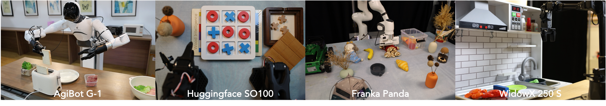
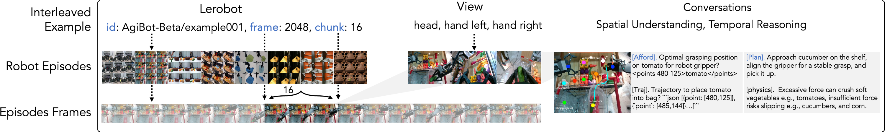

<p align="center">
  
</p>

<p align="left">
  <a href="http://eo-robotics.ai/eo-1">
    
  </a>
  <a href="https://arxiv.org/abs/TODO">
    
  </a>
  <a href="https://huggingface.co/collections/IPEC-COMMUNITY/eo-robotics-68ac4ff30e1f746cac28ca14">
    
  </a>
  <a href="https://huggingface.co/spaces/IPEC-COMMUNITY/EO-Robotics">
    
  </a>
  <a href="https://discord.gg/JqfDs6va">
    
  </a>
  <a href="mailto:wangdong@pjlab.org.cn">
    
  </a>
  <a href="https://huggingface.co/datasets/IPEC-COMMUNITY/EO-Data1.5M">
    
  </a>
</p>

## Interleaved Vision-Text-Action Pretraining for General Robot Control

We introduce **EO-1** model, an open-source unified embodied foundation model comprising 3B parameters, trained on the carefully curated interleaved embodied dataset EO-Data1.5M, Web Multimodal Data, and Robot Control Data (AgiBotWorld, Open X-Embodiment, RoboMIND, SO100-Community, etc.). The **EO-1** model adopt a single unified decoder-only transformer that integrates discrete auto-regressive decoding with continuous flow matching denoising for multimodal embodied reasoning and robot control, enabling seamless perception, planning, reasoning, and acting in single model. This work highlights the following features:

- ⚡ **Unified Architecture**: A single decoder-only transformer integrating text, image, video, and actions.
- 📚 **EO-1.5M Dataset**: 1.5M high-quality interleaved samples (Physical, Reasoning, Spatial, Control).
- 🌀 **Interleaved Pretraining**: Seamless synergy between language and action with autoregressive + flow matching.
- 🤖 **Reasoning-Enhanced Generalization**: Superior generalization capabilities with multimodal embodied reasoning and real robot control.

<p align="left">
  
</p>

## Installation Guidance

### 0. Install dependencies

Clone the repository:
```bash
git clone https://github.com/EO-Robotics/EO.git
cd EO
```

Create a conda environment and install dependencies:
```bash
conda create -n eo python=3.10
conda activate eo
pip install --upgrade setuptools
pip install --no-build-isolation flash-attn==2.7.1.post1
pip install -r requirements.txt
pip install -e .
```

### 1. Inference with pre-trained model
**EO-1** is built entirely on 🤗 HuggingFace Transformers and Lerobot, making deployment straightforward and accessible. If your environment supports transformers and lerobot, you can load the model and run inference directly with just a few lines of code (requires ~6.5GB GPU memory). **EO-1** unifies high-level embodied reasoning with low-level robot control, producing either natural language outputs or actionable robot commands.

```python
from transformers import AutoModel, AutoProcessor
# load the model and processor
processor = AutoProcessor.from_pretrained("IPEC-COMMUNITY/EO-1-3B", trust_remote_code=True)
model = AutoModel.from_pretrained(
  "IPEC-COMMUNITY/EO-1-3B", 
  trust_remote_code=True, 
  torch_dtype=torch.bfloat16
).eval().cuda()

# prepare the model input
batch = {
    "observation.images.image": [img], # PIL.Image
    "observation.images.wrist_image": [wrist_img],
    "observation.state": [state],
    "task": ["You are a helpful physical agent equipped with both reasoning and robotic control. \
      You see the Tic-Tac-Toe board, think strategically, act logically, and block threats."]
}

# generate multimodal outputs
output = processor.generate(model, batch)
text = output.text
actions = output.action.numpy()
```

### 3. Datasets
We use [LeRobot](https://github.com/huggingface/lerobot) as the primary source for robot control training and evaluation, with [Any4LeRobot](https://github.com/Tavish9/any4lerobot) providing convenient data conversion and preprocessing utilities.
For Multimodal data, e.g., image, video, text, points and bounding boxes, we follow the [Qwen2.5-VL](https://colab.research.google.com/github/QwenLM/Qwen2.5-VL/blob/main/cookbooks/spatial_understanding.ipynb) and [Qwen2-VL-Finetune](https://github.com/2U1/Qwen2-VL-Finetune) recipes. In interleaved pretraining, we integrate the EO-Data1.5M dataset — a large-scale, high-quality embodied dataset designed to unify reasoning and control. Data are organized in a standardized format as shown below:
<p align="left">  </p>
Here, the `lerobot` and `view` fields connect actions with multimodal conversations, enabling the model to capture the rich temporal dynamics and causal dependencies among vision, language, and action modalities — a core requirement for robust performance in open-world embodied interactions.

To combine robot control data and multimodal data, we support a flexible YAML-based configuration, where each dataset can be assigned weights and sampling strategies. This makes it easy to balance embodied control trajectories with multimodal reasoning data for interleaved training. For example:
```yaml
# configs/example.yaml
mm_datasets: # optional
  - json_path: LEROBOT_DATASET/bridge_interleaved_data.jsonl
    sampling_strategy: random:5%
  
  - json_path: RefCOCO/refcoco.jsonl
    sampling_strategy: random:10%

lerobot_datasets:
  - repo_id: bridge
    select_video_keys: [observation.images.image_0]
```

### 2. Fine-tuning on your dataset
**EO-1**, Mastering Diverse Manipulations on Multiple Embodiments, demonstrates its robustness and adaptability by performing a wide range of dexterous manipulation tasks across heterogeneous robotic platforms. We evaluate its performance on both short-horizon and long-horizon tasks, spanning Franka Panda, WidowX 250 S, AgiBot G-1, and LeRobot SO100.
<p align="left">
  
</p>

To fine-tune **EO-1** on your own embodiment, you only need to adapt the configuration file. Specifically, convert your dataset into the LeRobot format, then define the fields that describe where your videos, states, and actions are located. The following YAML snippet shows a typical setup:

```yaml
# @multimodal corpora
mm_datasets: 

# @robot control episodes
lerobot_datasets:
  - repo_id: AgiBotWorld-Beta/example001 # dataset identifier
    root: /oss/vla_next/DATA # path to the dataset root directory
    
    # Optional fields:
    train_subtask: mixture:0.9 # mix sub-task instructions and overall instructions with 90% sub-task
    delta_action: false # train with delta actions
    select_video_keys: [observation.images.head, observation.images.hand_left, observation.images.hand_right] # which camera streams to load
    select_state_keys: [observation.states.joint.position, observation.states.effector.position] # proprioceptive states
    select_action_keys: [actions.joint.position, actions.effector.position] # the action targets to supervise during training
    select_effector_keys: [actions.effector.position] # effector control channels
    effector_indices: [14, 15] # indices of effector channels in the flattened action vector
```
Once your dataset is prepared and the configuration file (e.g., example.yaml) is set up, you can launch fine-tuning with the following command. We use torchrun to support distributed or multi-GPU training, while the arguments control training mode, optimization, and which model components to freeze or update.

```bash
torchrun $TORCH_RUN_ARGS onvisfm/train.py \
  ${model_name_or_path:+--model-name-or-path $model_name_or_path} \ # load pre-trained model
  --vlm-name-or-path ../pretrained/Qwen2.5-VL-3B-Instruct \ # load vlm backbone from Qwen2.5-VL-3B-Instruct
  --train-lerobot-only True \ # w/o multimodal data
  --data-path configs/example.yaml \
  --chunk-size 16 \
  --dataloader-num-workers 8 \
  --freeze-vision-tower False \
  --freeze-llm False \
  --tune-merger True \
  --bf16 True \
  --tf32 True \
  --num-train-epochs 25 \
  --per-device-train-batch-size 64 \
  --learning-rate 5e-5 \
  --merger-lr 5e-5 \
  --vision-lr 1e-5 \
  --warmup-ratio 0.03 \
  --gradient-checkpointing True \
  --save-steps 2000 \
  --report-to wandb \
  --run-name bridge \
  --state-mode MAEN_STD \
  --output-base eo-1
```

## Benchmark

Mastering Diverse Manipulations on Multiple Embodiments

| Model        | Franka Pick-and-Place (7 Tasks) | AgiBot Long-horizon Dexterity (4 Tasks) | WidowX Out-of-Box (13 Tasks) | Reasoning Control (4 Tasks) |
|--------------|---------------------------------|-----------------------------------------|------------------------------|-----------------------------|
| $\pi_0$-fast | 0.610                           | 0.449                                   | 0.227                        | —                           |
| $\pi_0$      | 0.831                           | 0.672                                   | 0.693                        | 0.525                       |
| GR00T-N1.5   | 0.857                           | 0.681                                   | 0.705                        | 0.617                       |
| **EO-1**     | **0.935**                       | **0.807**                               | **0.852**                    | **0.831**                   |

Multi-modal Benchmark Results

| Model               | RoboVQA  | ERQA     | EO-Bench @ Spatial | EO-Bench @ Temporal | Overall  |
|---------------------|----------|----------|--------------------|---------------------|----------|
| Claude 3.5          | 26.7     | 35.5     | 24.0               | 34.8                | 30.3     |
| GPT-4o (2024-11-20) | 47.2     | 40.0     | 35.6               | 39.3                | 40.5     |
| Qwen2.5 VL 3B       | 55.9     | 35.3     | 20.0               | 22.6                | 33.5     |
| Magma 8B            | 30.3     | 29.3     | 29.4               | 36.7                | 31.4     |
| **EO-1 (3B)**       | **58.5** | **45.5** | **36.4**           | **38.9**            | **44.8** |

Robot Control Benchmark Results

| Model        | LIBERO    | Simpler @ Google VM | Simpler @ Google VA | Simpler @ WidowX VM |
|--------------|-----------|---------------------|---------------------|---------------------|
| $\pi_0$      | 0.942     | 0.714               | 0.714               | 0.692               |
| $\pi_0$-fast | 0.855     | 0.464               | 0.464               | 0.321               |
| GR00T-N1     | 0.939     | —                   | —                   | —                   |
| Magma        | —         | 0.488               | 0.488               | 0.448               |
| **EO-1**     | **0.982** | **0.765**           | **0.765**           | **0.727**           |

## 📅 Roadmap

- [ ] 🤗 Release models: `EO-1-3B`, `EO-1-3B-Bridge` and `EO-1-3B-Fractal`.
- [ ] 🔥 Release Interleaved Dataset `EO-Data1.5M`, benchmark `EO-Bench` and all the pre-training code.
- [ ] ⚡️ Efficient LLM Inference over Long Sequences.
- [ ] 🤖 Integrate with RLHF for human feedback fine-tuning.

## 🤝 Contributing
We welcome contributions! Please check out CONTRIBUTING.md. Join our community on Discord.

## 📚 Citation

If you find this project useful, please consider citing:

```bibtex
@article{eo-robotics,
  title={EmbodiedOneVision: Interleaved Vision-Text-Action Pretraining for General Robot Control},
  author={Qu, Delin and Song, Haoming and Chen, Qizhi and Chen, Zhaoqing, and Gao Xianqiang, and Ye, Xinyi, and Modi Shi, and Guanghui Ren and Maoqing Yao, and Zhao, Bin and Wang, Dong},
  journal={arXiv preprint},
  year={2025}
}
```


## Acknowledgement

**EO-1** is built with reference to the code of the following projects: 
- [Qwen2.5-VL](https://github.com/QwenLM/Qwen2.5-VL)
- [Qwen2-VL-Finetune](https://github.com/2U1/Qwen2-VL-Finetune)
- [LERobot](https://github.com/huggingface/lerobot)
- [Any4LERobot](https://github.com/Tavish9/any4lerobot)

Thanks for their awesome work!